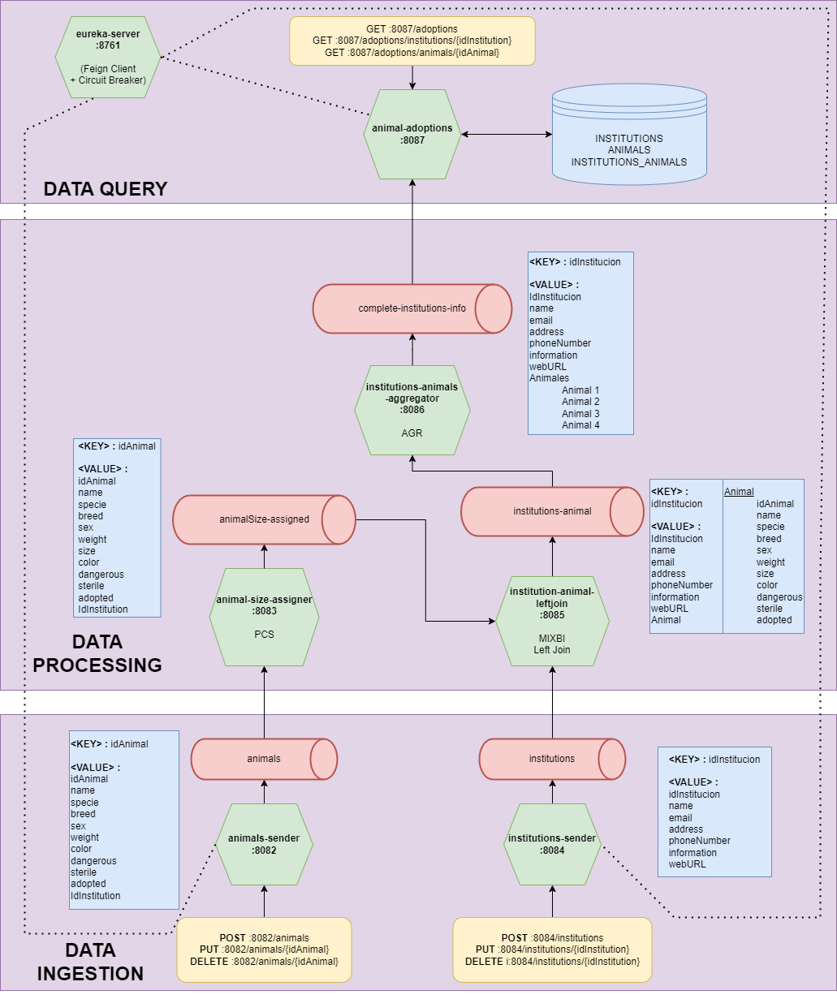

# adoptions-kafka
Kafka project for Microservices Hiberus University

# Usage guide
1. ```git clone https://github.com/Leticia-23/adoptions-kafka.git```
2. ``mvn clean install`` to install the project dependencies
3. ``docker-compose up --build`` 
4. Execute eureka-service service
5. Run the rest of the services to have complete correct functionality.

# Documentation

- Redpanda: http://localhost:8080
- Eureka server: http://localhost:8761/
- Animals API: http://localhost:8082/swagger-ui.html
- Institutions API: http://localhost:8084/swagger-ui.html
- Adoptions API: http://localhost:8087/swagger-ui.html

# Software Arquitecture
